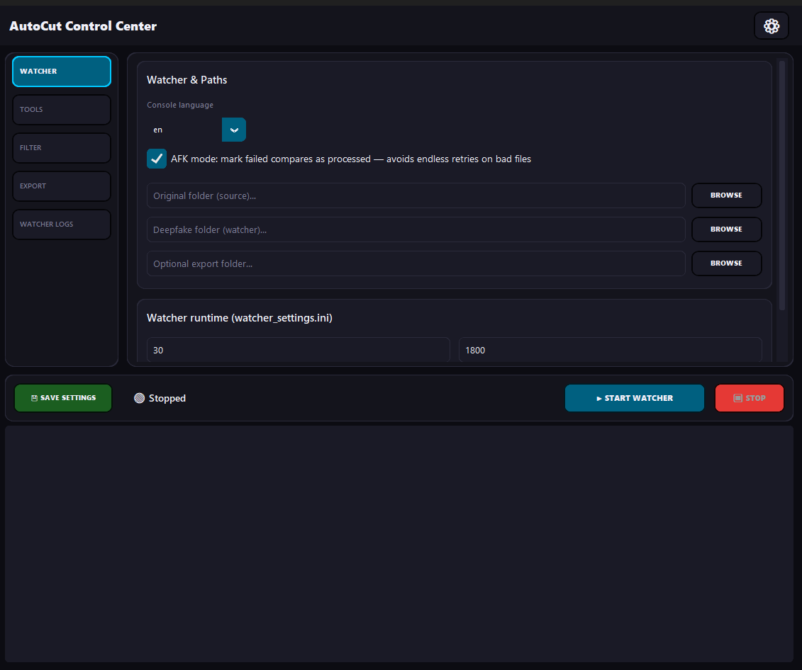

# Flickchecker

**Deepfake swap detector & auto-cutter** for Windows. Compares a source video with a deepfake frame by frame, finds where the swap holds vs. glitches, and can output **DaVinci Resolve EDLs** (with markers), **FFmpeg** cuts (e.g. NVENC), and optionally drive **DaVinci Resolve Studio** via its scripting API.

Includes a **Control Center** GUI (`gui.py` / `gui.exe`), an **Auto-Watcher** for hands-off folders, and a **Flickercheck** UI to tune pixel thresholds visually.

Pre-built releases can run **without installing Python**; this repository is the **source** tree.

## UI

Control Center (dark theme example). Paths in the screenshot are placeholders only.



- **Export** tab: optional **“Video export files”** block — do not overwrite FFmpeg / DaVinci outputs; filenames get a filter-based suffix (`export_avoid_overwrite` in `settings.ini`).
- **Light / Dark** is stored under `[GUI]` → `ui_theme` in `settings.ini` and applies to the Control Center and to **Flickercheck** (`flickercheck_ui.py`) via shared `theme_palette.py`.

## Documentation

| File | Audience |
|------|----------|
| **[Readme.txt](Readme.txt)** | Full user guide: `settings.ini`, DaVinci setup, Watcher, Send To, troubleshooting |
| **[DEV_README.md](DEV_README.md)** | Developers: venv, `pip install`, running from source |

## Quick start (source)

```bat
pip install -r requirements.txt
copy settings.example.ini settings.ini
copy watcher_settings.example.ini watcher_settings.ini
python gui.py
```

## Easy start on Windows (batch files)

For a simpler source workflow on Windows, use the included batch scripts:

```bat
install_requirements.bat
start_gui.bat
```

- `install_requirements.bat` installs Python dependencies from `requirements.txt`.
- `start_gui.bat` starts the Control Center GUI (`gui.py`).

Edit the `.ini` files (or use the GUI **Save Settings**) before processing real jobs.

## Requirements

- Windows (primary target)
- Python 3.x + dependencies in `requirements.txt` when running from source
- Optional: **DaVinci Resolve Studio** for API export; **FFmpeg** / **ffmpeg.exe** for encodes

## Repo layout (high level)

| Module | Role |
|--------|------|
| `compare.py` | Analysis, EDL, FFmpeg, DaVinci export |
| `gui.py` | Control Center |
| `watcher.py` | Folder watcher → `compare` with `--auto` |
| `flickercheck_ui.py` | Visual threshold tuning |
| `theme_palette.py` | Shared colors + `load_ui_theme_is_light()` for GUI + Flickercheck |

## License

[GNU General Public License v3.0](LICENSE) — see [LICENSE](LICENSE) for the full text.

Copyright © 2026 the Flickchecker contributors.
